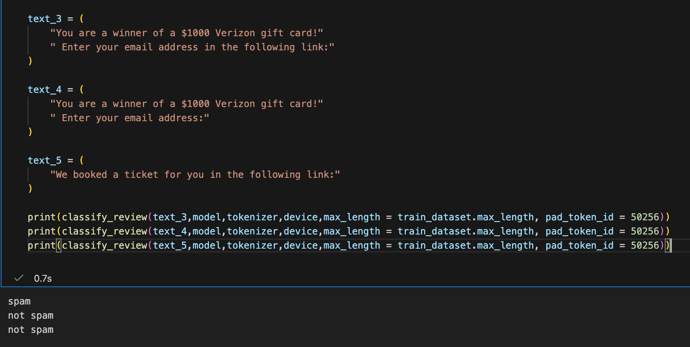

# Spam Message Classifier

Production spam detection tool built from Sebastian Raschka's book *Build a Large Language Model (From Scratch)* Chapter 6 (LoRA fine-tuning on GPT-2).

## 🎯 My Background
- MIT Mathematics Instructor (C.L.E. Moore Instructor, 2024–2027)
- Research Interest: Machine learning theory on transformers and diffusion models
- Transitioning to AI Engineer
  
## 🚀 Live Demo
**Try the Spam Classifier now:**  
[🌐 Open Live Demo](https://huggingface.co/spaces/AlexLin26/math-llm-demo)

- Real LoRA fine-tuned GPT-2 model (Chapter 6)
- Outputs: SPAM / HAM + confidence score + mathematical explanation
- Uses tiktoken tokenizer + full Transformer architecture

## Files
- `chapter6.ipynb`: Original training notebook
- `spam_classifier.py`: Core classifier (book Chapter 6 style)
- `spam_classifier_model.pth`: Pre-trained LoRA weights
- `demo_spam_classifier.ipynb`: Main Gradio demo

## How to Run Locally
1. Open `demo_spam_classifier.ipynb`
2. Run all cells
3. Enter any message to classify
 
**Star / Fork welcome!**  
This is my main production AI project focusing on practical classification with mathematical insight from my research.
